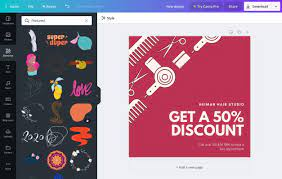
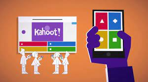
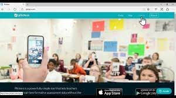
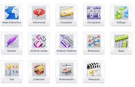
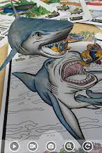
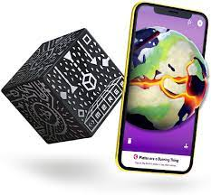

# HERRAMIENTAS DIGITALES Y ACTIVIDAD DOCENTE: APLICACIÓN EN EL AULA

## Objetivos
- Mejorar la competencia digital docente del profesorado, proporcionándoles un kit de herramientas digitales muy diversas con distintas funcionalidades, útiles para el ámbito educativo.
- Dotar al profesorado de herramientas digitales funcionales tanto para el proceso de enseñanza-aprendizaje a distancia como presencial usando las TACs.
- Evaluar de forma eficaz usando plataformas digitales.
- Conocer y profundizar en algunas herramientas y recursos propuestos para la creación de contenido educativo con aplicación real en el aula.
- Propiciar la interacción y capacitación de los docentes generando debates, aportaciones y materiales entre los participantes a través de las experiencias personales y el diseño o creación de actuaciones educativas innovadoras.

## Contenidos

* Introducción
    * [Licencias](Licencias.md)
    * Recursos [sonoros](BancosSonidosMusica.md) y [visuales](https://aonialearning.com/herramientas/recursos-digitales-aula-online/)

* Presentaciones:
    * [Canva](https://www.canva.com/es_es/)
    
    * [Genially](https://genial.ly) [Tutorial](https://www.educaciontrespuntocero.com/recursos/tutorial-crear-un-kahoot-para-clase/)
    * Crea comics con [pixton](https://edu-es.pixton.com/solo/)
    
* Tests/Juegos
    * [Kahoot](https://kahoot.it/)
    
    * [Plickers](https://get.plickers.com/)
    
    * [Educaplay](https://es.educaplay.com/)
    

* Realidad aumentada/Virtual
    * [Quiver](https://quivervision.com/)
    
    * [MergeCube](https://mergeedu.com/cube/es)
    
    * [Google Expeditions](https://artsandculture.google.com/project/expeditions)
    
* [Podcast](./Podcast.md)
    * Last.fm
    * iVoox
    * [Edición de audio](edicionAudio.md)
* Grabación de vídeo [Android](GrabacionAndroid.md) y [iPad](GrabacionIPad.md)
* Edición de vídeo
    * [Cap Cut](https://play.google.com/store/apps/details?id=com.lemon.lvoverseas&hl=es&gl=US)
    * [Kinemaster](https://play.google.com/store/apps/details?id=com.nexstreaming.app.kinemasterfree&hl=es_419&gl=US)
    * [Croma](./Croma.md
    )

* Guardar contenidos: [Pocket](https://getpocket.com)

## Recursos

[Colección 1](https://view.genial.ly/5868e75b5fb78284e08775c5/interactive-content-tabla-periodica-herrsdigitales)
[Colección 2](https://matematicas11235813.luismiglesias.es/catalogo-de-herramientas-didacticas-educativas/#.YfXKLWkumDZ)